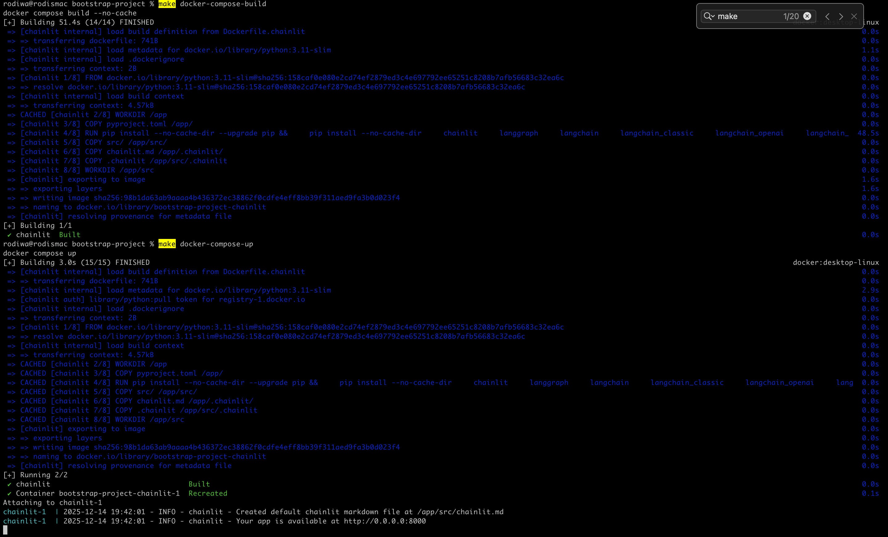
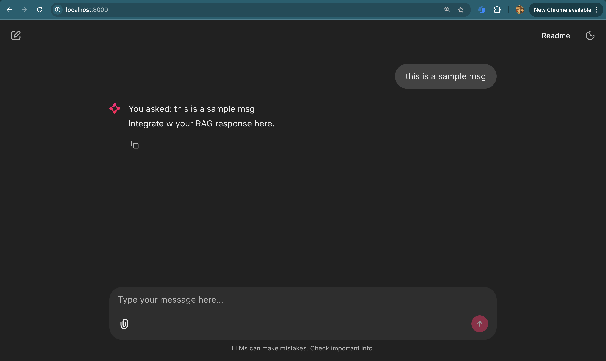
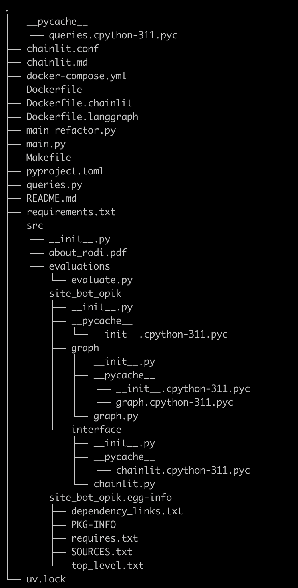

# langgraph-chainlit-docker-nginx

Note - Unless you're using the same tech stack, you won't find this one very useful. But if you're new, you can and should use this tech stack to get started.
Inspiration for this code base has been - 
https://github.com/neural-maze/ava-whatsapp-agent-course

## How To Use This Repo
- Clone/ fork this repo.
- Activate venv.
- Test if it works.
  - Main things you wanna check are
    - running  `main.py` (RAG backend)
    - running chainlit (RAG app interface)
    - docker compose build (for deployment)**
    - docker compose up (for deployment)**
- Use Makefile commands to start.
- Make changes for your project.
- Update pyproject.toml
- Update "git remote -v" for your own repo.

** Basically if you can run `make docker-compose-build` and ``make docker-compose-up` w/o any errors - you are good to go!

** Your localhost:8000 should look like this

## Features
- RAG backend
- Interface to app
- In Memory DB
  - Can be swapped for any other DB, RedisSaver, MongoDB-Saver, etc.
  - TIP - Use cloud providers when starting out, Qdrant, Pinecone, Weaviate

## Projects Structure

### Important Note On Module Imports
Project uses absolute paths to import modules (import graph module to chainlit, etc) which got pretty tricky for me, esp when dockerising/ deploying the project. I had to setup a few hacks, like building using setup tools in pyproject.toml. using `__init__` files and building from root folder. Make sure you understand this well.

See https://realpython.com/python-modules-packages/ for more.

## TODOs/ Enhancements
- Caching Strategies
  - Node based
  - Flow based
- Caching Types
  - Prompt
  - Semantic
- Cron-triggered evaluations
  - Basic setup is done.
  - Create your own dataset and upload to Opik.
  - Can trigger evals from Opik or programmatically.
    - See src/evaluations
  - Will add more
  - I plan to create bootstrap for other types/ stacks too. New branches will be created accordingly.

### The .gitignore hack
uv init sets up `.gitignore` that was not useful for me - did not add .env to list. I also use personal files like .data which would get added.
SO I ended up creating a default .`~/.gitignore-global` file on my local and setting this up as default when `git init`s, and configuring git config globals to point to this `~/.gitignore-global`

You should probably setup a default .gitignore as per the language you are uing. Like [python .gitignore](https://github.com/github/gitignore/blob/main/Python.gitignore).

## Final Thoughts

Use this as a starting point for you AI/ML career coding. This is how I start my projects and it's saved me lot of time.

I have a few more project templates like (MLFlow, Airflow, core ML pipelines stuff, etc) I want to update here. I'll add them soon.

If you find any configs/ personal tokens I shouldnt have left out, let me know. Karma's a B!