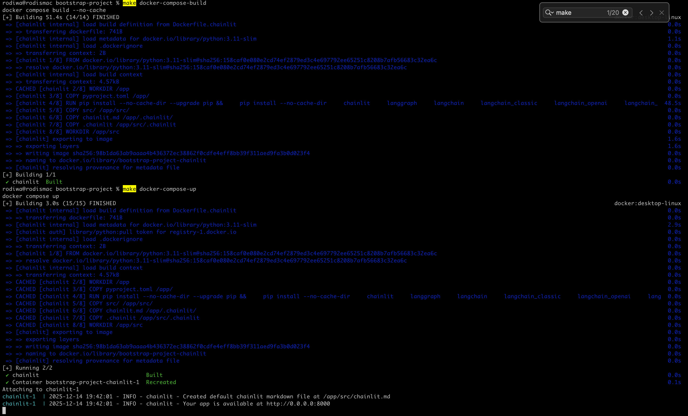
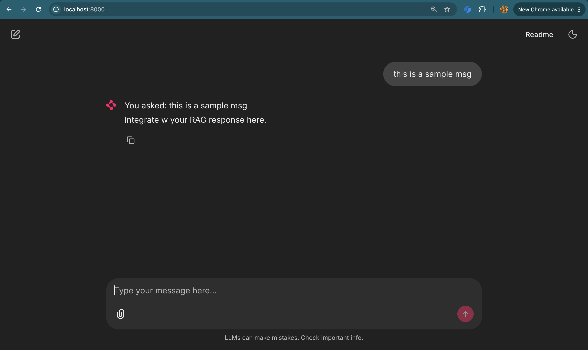
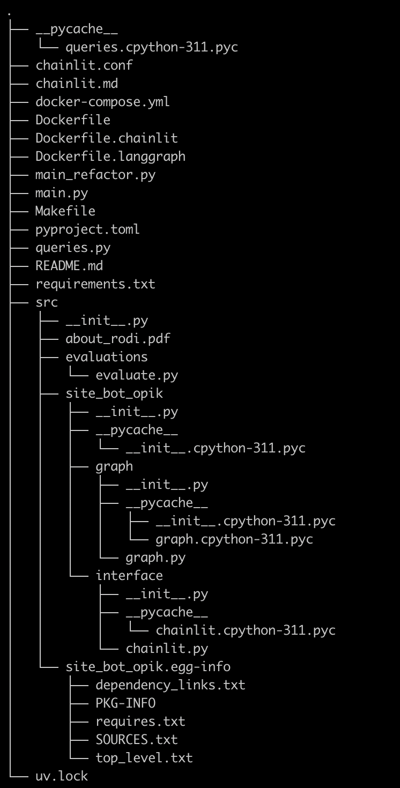

# AI Project Bootstrap 🚀

**Stop re-building the same boilerplate. Start with a stack that already works.**

The hardest part of starting a new project is having to setup basic infra from scratch all over again.

Since I had similar projects in the pipeline, me thoughts its best to bootstrap it with code-template that's already worked before.

Check out branches to get started
- `langgraph-chainlit-docker-nginx`

## What's In Here

Each branch is a self-contained, production-ready starter for a specific stack. The main branch you'll want to start with:

### `langgraph-chainlit-docker-nginx`
A full-stack RAG app template ready to run locally and deploy:

🧠 **RAG Backend** → LangGraph multi-node pipeline with in-memory vector store (swappable)
💬 **Chat Interface** → Chainlit UI, no frontend code required
🐳 **Docker Ready** → `docker compose up` and you're live
🌐 **Nginx Configured** → Reverse proxy setup included
📦 **Clean Module Structure** → Absolute imports, setup tools, no import hacks

## More Branches

| Branch | Stack |
|---|---|
| `chainlit-interface` | Chainlit UI patterns |
| `fastapi-interface` | FastAPI backend alternative |
| `memory-prompt-caching` | Caching strategies (node-level, flow-level) |
| `evals` | Evaluation pipeline with Opik |
| `e2e-evals-cicd` | CI/CD-triggered evaluations |
| `hitl` | Human-in-the-loop patterns |
| `voice` | Voice interface integration |
| `computer-vision` | CV pipeline starter |
| `deterministic-subagents` | Deterministic subagent orchestration |
| `orchestration-a2a-mcp` | Agent-to-agent + MCP orchestration |
| `multi-data-sources-rag` | RAG across multiple data sources |
| `superviser-agent` | Supervisor agent pattern |
| `threads` | Thread/conversation management |
| `realtime-ingestion` | Real-time data ingestion |
| `edd` | Event-driven design patterns |
| `metrics` | Metrics and monitoring |

## 🛠 Technology Stack

**UI**: Chainlit
**Backend**: LangGraph (multi-node pipeline)
**Vector Store**: In-memory (drop-in replacement for Qdrant, Pinecone, Weaviate)
**Deployment**: Docker Compose + Nginx
**Package Manager**: `uv`
**Observability**: Opik (evaluations)

## 🚀 Quick Setup

### Prerequisites

- Python 3.11+
- `uv` package manager
- Docker (for deployment)
- OpenAI API key (minimum to get started)

### Local Setup

1. **Clone the repo and switch to your chosen branch**
   ```bash
   git clone https://github.com/rodiwaa/bootstrap-project.git
   cd bootstrap-project
   git checkout langgraph-chainlit-docker-nginx
   ```

2. **Install dependencies**
   ```bash
   uv sync
   source .venv/bin/activate
   ```

3. **Set up environment**
   ```bash
   cp .env-example .env
   # Add your OPENAI_API_KEY at minimum
   ```

4. **Add your RAG source file**
   ```bash
   # Drop a PDF into .data/ (e.g. about_me.pdf)
   # Update the file path and queries in the code accordingly
   ```

5. **Run the app**
   ```bash
   make run-ui
   ```
   Opens the Chainlit interface at `http://localhost:8000`

### Deploy with Docker

```bash
make docker-compose-build
make docker-compose-up
```

If both run without errors, you're ready to deploy.



Your `localhost:8000` should look like this:



## 📁 Project Structure



```
src/
  graph/        # LangGraph pipeline and state definitions
  interface/    # Chainlit UI entry point

main.py         # CLI / RAG backend entry point
pyproject.toml  # Dependencies and package config (uv)
Makefile        # Common commands
docker-compose.yml
```

### A Note on Module Imports

The project uses absolute imports across modules (e.g. importing the graph into Chainlit), which gets tricky when Dockerising. The setup uses `setuptools` in `pyproject.toml` with `__init__.py` files and builds from the root. If you're changing the structure, understand this first — it'll save you hours.

See [Python Modules & Packages](https://realpython.com/python-modules-packages/) for background.

## 💡 How to Customise

1. Swap the vector store — replace the in-memory store with Qdrant, Pinecone, or Weaviate (cloud providers recommended when starting out)
2. Update `pyproject.toml` with your project name and dependencies
3. Point git remote to your own repo: `git remote set-url origin <your-repo>`
4. Update the RAG source file and queries to match your domain

## 📊 Observability & Evals

The `evals` and `e2e-evals-cicd` branches include an evaluation setup using **Opik**:
- Create your own dataset and upload to Opik
- Trigger evaluations from Opik or programmatically
- CI/CD-triggered eval runs on push

See `src/evaluations` for the base setup.

## 📄 License

All Rights Reserved.
